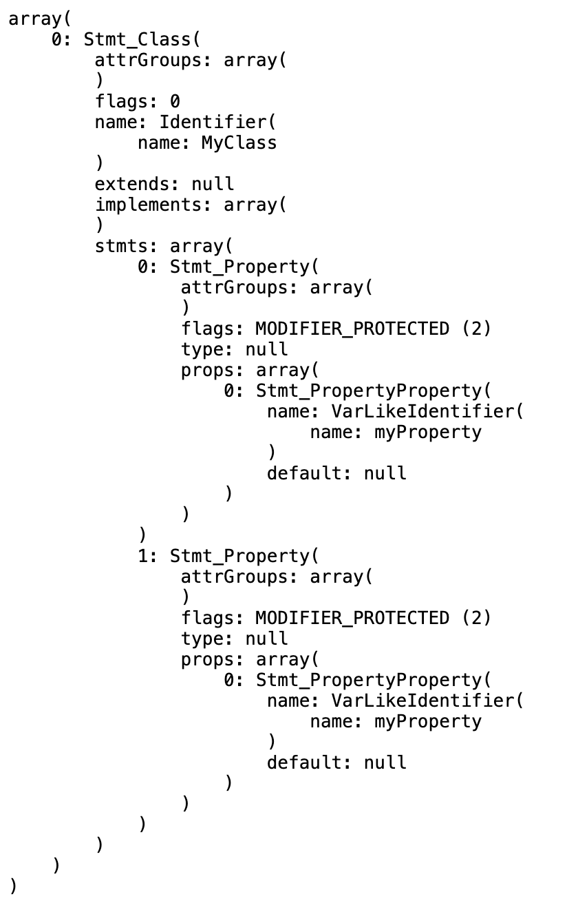
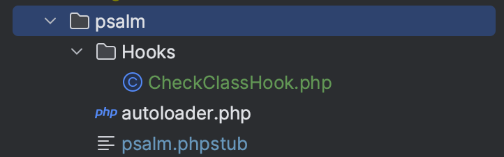

## Создание плагина для psalm

На создание заметки меня натолкнул поиск решения казалось бы банальной проблемы. Допустим, есть такой код:

```php
<?php
class MyClass {
    protected $myProperty;
    ...
    protected $myProperty;
}
```
Если интерпретатору попадётся файл с таким кодом, то вылетит ошибка "can not redeclare field myProperty". PHPStorm на такой код реагирует правильно и подсвечивает весь файл, но файлов в проекте может быть много и за всеми не уследишь, да и обновление состояния PHPStorm не мгновенное в силу большого количества файлов в проекте для анализа. А возникнуть такая ситуация может из-за некорректного разруливания конфликтов при мерже (увы, реальный кейс). 

Поэтому встала задача подобную ошибку изловить до момента сборки production. Мы у себя в качестве анализатора кода используем psalm на уровне 8 (в силу legacy кода проекта) и этот уровень способен отлавливать синтаксические ошибки, однако данную ошибку psalm не видит. Я пробовал понижать уровни до первого, но всё равно данный код считается psalm'ом корректным. Причём дублирование методов класса psalm отлавливает. Это поначалу сбило с толку. Тогда я попробовал разобраться в проблеме глубже.

Сначала я разобрал этот код через AST. Для работы взял пакет __nikic/php-parser__ и вот какой вывод получился:



Т.е. парсер не считает этот код синтаксически неверным. Однако через AST мы можем получить все аттрибуты класса и перебрать их, выискивая дубли. Тогда попробуем написать свой плагин для psalm, чтобы отлавливать такие моменты самостоятельно и подсвечивать их. Вот здесь (https://psalm.dev/docs/running_psalm/plugins/authoring_plugins/) есть инструкция по написанию своего плагина, но она довольно скудная, а гуглинг вопроса дал ссылку только на одну статью хабре и её клоны. Её и возьмём за основу. В статье описывается способ создать свой плагин и разместить его на packagist, чтобы psalm умел с ним работать динамически, но это избыточно для нашего проекта, поэтому плагин будем размещать в самом проекте рядом со всеми необходимыми psalm файлами:



И вот тут начинается отличие от статьи, которое от меня долго ускользало. Если мы пишем плагин для packagist, то условно нам надо создать файл-плагин и файл-хук. Файл-плагин регистрирует хук. А в случае плагина для проекта нужно написать только хук и указать путь к нему в конфигурации psalm:

```xml
<plugins>
    <plugin filename="psalm/Hooks/CheckClassHook.php" />
</plugins>
```

Хук должен имплементировать один из доступных нам интерфейсов. Эти интерфейсы отвечают за различные события, возникающие при работе анализатора. Документации маловато (https://psalm.dev/docs/running_psalm/plugins/authoring_plugins/#psalm-api), но мне подошёл интерфейс __Psalm\Plugin\EventHandler\AfterClassLikeVisitInterface__, так как он даёт внутри себя нужное для анализа дерево (ast) класса. Далее остаётся написать такой код:

```php
<?php

use PhpParser\Node\Stmt\Property;
use Psalm\CodeLocation;
use Psalm\IssueBuffer;
use Psalm\Plugin\EventHandler\AfterClassLikeVisitInterface;
use Psalm\Plugin\EventHandler\Event\AfterClassLikeVisitEvent;

/**
 * Плагин для psalm по анализу классов
 */
class CheckClassHook implements AfterClassLikeVisitInterface
{
    public static function afterClassLikeVisit(AfterClassLikeVisitEvent $event)
    {
        self::checkDuplicateProperties($event);
    }

    /**
     * Проверка дублирующихся полей в классе
     *
     * @param AfterClassLikeVisitEvent $event
     *
     * @return void
     */
    protected static function checkDuplicateProperties(AfterClassLikeVisitEvent $event): void
    {
        $className = $event->getStmt()->name->name;
        $statementsSource = $event->getStatementsSource();

        $properties = [];

        foreach ($event->getStmt()->stmts as $stmt) {
            if (!$stmt instanceof Property) {
                continue;
            }

            $propertyName = $stmt->props[0]->name->name;

            if (in_array($propertyName, $properties)) {
                IssueBuffer::maybeAdd(
                  new \Psalm\Issue\DuplicateMethod(
                    "Property $propertyName has already been defined in class $className",
                    new CodeLocation($statementsSource, $stmt)
                  ),
                );
            }

            $properties[] = $propertyName;
        }
    }
}
```

В нём мы перебираем свойства класса и, если свойство уже встречалось ранее, выкидываем issue. Я не стал писать отдельный вид issue под данную проблему, а воспользовался __DuplicateMethod__. Итог работы psalm такой:

```text
Scanning files...
Analyzing files...

E

ERROR: DuplicateMethod - test.php:12:5 - Property myProperty has already been defined in class myClass (see https://psalm.dev/178)
    protected $myProperty;


------------------------------
1 errors found
------------------------------
```